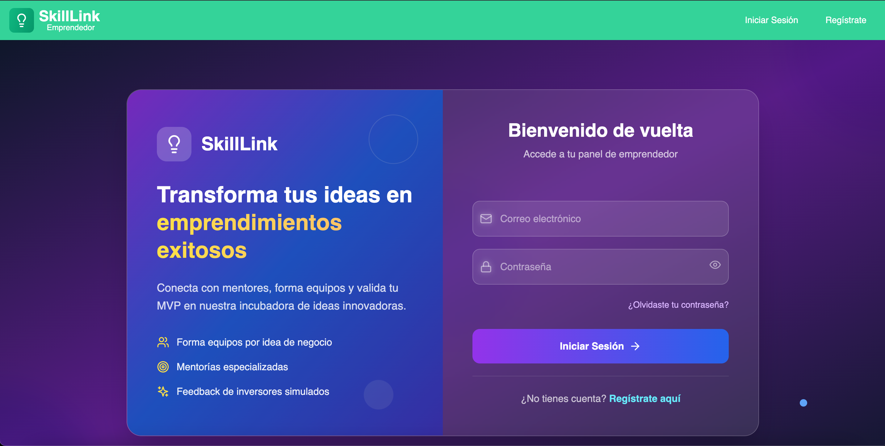

# 🚀 SkillLink Emprendedor

**Una plataforma web que funciona como incubadora digital de ideas de negocio, conectando emprendedores novatos con mentores expertos e inversores simulados.**

 

## 📋 Descripción del Proyecto

SkillLink Emprendedor facilita la formación de equipos multidisciplinarios, proporciona mentorías especializadas y guía a los usuarios desde la conceptualización de ideas hasta la presentación de pitches validados.

### 🎯 Propuesta de Valor
> "Transforma tu idea en un MVP validado en 4 semanas con mentoría experta y feedback de inversores"

### 👥 Público Objetivo
- **Emprendedores novatos:** Estudiantes y profesionales con ideas de negocio
- **Mentores expertos:** Profesionales con experiencia en áreas específicas  
- **Inversores simulados:** Evaluadores que proporcionan feedback empresarial

## 🛠️ Tecnologías Utilizadas

### Frontend
- **React 18.3.1** - Biblioteca de UI
- **TypeScript 5.5.3** - Tipado estático
- **Vite 6.3.5** - Build tool y dev server
- **Tailwind CSS 3.4.1** - Framework de CSS
- **React Router DOM 7.6.2** - Enrutamiento
- **Lucide React 0.344.0** - Iconografía
- **ESLint** - Linting y calidad de código

### Backend
- **Spring Boot 3.5.0** - Framework de Java
- **Java 23** - Lenguaje de programación
- **Spring Security** - Autenticación y autorización
- **Spring Data JPA** - Persistencia de datos
- **MySQL 8.0.33** - Base de datos
- **JWT (java-jwt 4.4.0)** - Autenticación con tokens
- **SpringDoc OpenAPI** - Documentación de API
- **Maven** - Gestión de dependencias

## 🚀 Instalación y Ejecución

### Prerrequisitos
- Node.js 18+ 
- Java 23+
- MySQL 8.0+
- Maven 3.6+

### 🔧 Configuración del Proyecto

#### 1. Clona el repositorio
```bash
git clone 
cd skilllink-emprendedor
```

#### 2. Backend (Spring Boot)
```bash
cd backend

# Configura la base de datos en application.properties
cp src/main/resources/application.properties.example src/main/resources/application.properties

# Instala dependencias y ejecuta
mvn clean install
mvn spring-boot:run
```

El backend estará disponible en: `http://localhost:8080`

#### 3. Frontend (React + Vite)
```bash
cd frontend

# Instala dependencias
npm install

# Inicia el servidor de desarrollo
npm run dev
```

El frontend estará disponible en: `http://localhost:5173`

### 📊 Base de Datos

#### Configuración de MySQL
```sql
CREATE DATABASE skilllink_db;
CREATE USER 'skilllink_user'@'localhost' IDENTIFIED BY 'password';
GRANT ALL PRIVILEGES ON skilllink_db.* TO 'skilllink_user'@'localhost';
FLUSH PRIVILEGES;
```

#### Variables de Entorno (.env)
```bash
# Backend
DB_HOST=localhost
DB_PORT=3306
DB_NAME=skilllink_db
DB_USERNAME=skilllink_user
DB_PASSWORD=password
JWT_SECRET=tu-jwt-secret-key
```

## 🎯 Funcionalidades Principales

### ✨ Para Emprendedores
- [ ] Crear y gestionar proyectos
- [ ] Formar equipos multidisciplinarios
- [ ] Solicitar mentorías especializadas
- [ ] Desarrollar y validar MVPs
- [ ] Presentar pitches colaborativos

### 👨‍🏫 Para Mentores
- [ ] Definir áreas de expertise
- [ ] Gestionar sesiones de mentoría
- [ ] Proporcionar feedback estructurado
- [ ] Evaluar progreso de equipos

### 💼 Para Inversores Simulados
- [ ] Revisar pitches presentados
- [ ] Evaluar viabilidad de mercado
- [ ] Proporcionar feedback empresarial
- [ ] Calificar presentaciones

## 📸 Capturas de Pantalla

### Dashboard Emprendedor

*Panel principal para gestión de proyectos y seguimiento de MVP*

### Dashboard Mentor

*Panel de mentorías activas y gestión de sesiones*

## 🔗 APIs Disponibles

### Documentación Swagger
Una vez ejecutado el backend, la documentación interactiva estará disponible en:
`http://localhost:8080/swagger-ui.html`

### Endpoints Principales
- `POST /api/auth/register` - Registro de usuarios
- `POST /api/auth/login` - Inicio de sesión
- `GET /api/projects` - Listar proyectos
- `POST /api/projects` - Crear proyecto
- `GET /api/mentorships` - Listar mentorías
- `POST /api/teams` - Formar equipos

## 📦 Build para Producción

### Frontend
```bash
cd frontend
npm run build
```

### Backend
```bash
cd backend
mvn clean package
```

## 👨‍💻 Desarrolladores

- **Joseph Aparicio** - *Full Stack Developer* - [@JosephAparicio](https://github.com/JosephAparicio) - joseph_539_11@hotmail.com
- **David Castro** - *Full Stack Developer* - [@deca-dev](https://github.com/deca-dev) - davidernesto.castroanaya@gmail.com
- **Harry Hernández** - *Front End Developer* - [@HarryHndz](https://github.com/HarryHndz) - harry200490@gmail.com
- **José Carmona** - *Front End Developer* - [@pecarper](https://github.com/pecarper) - ing.jmcarmona@gmail.com
- **Andy Alexis** - *Back End Developer* - [@AndyAlexisJA11](https://github.com/AndyAlexisJA11) - andialexis@hotmail.com
- **Cesar Mecinas** - *Back End Developer* - [@Piga962](https://github.com/Piga962) - cesarjrmecinas@gmail.com
- **Jesus Octavio Garcia** - *Back End Developer* - [@octavio5545](https://github.com/octavio5545) - j.octavio.ibs@gmail.com
---

